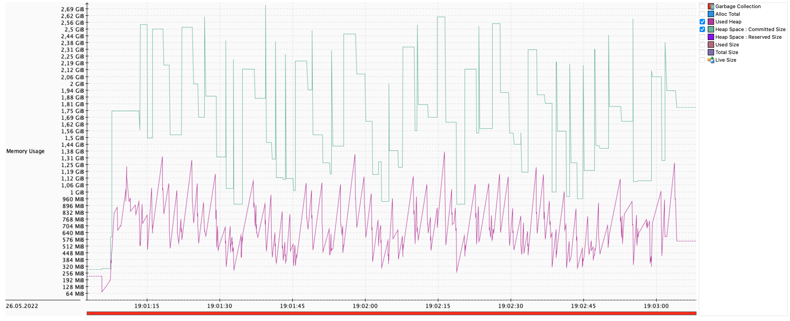
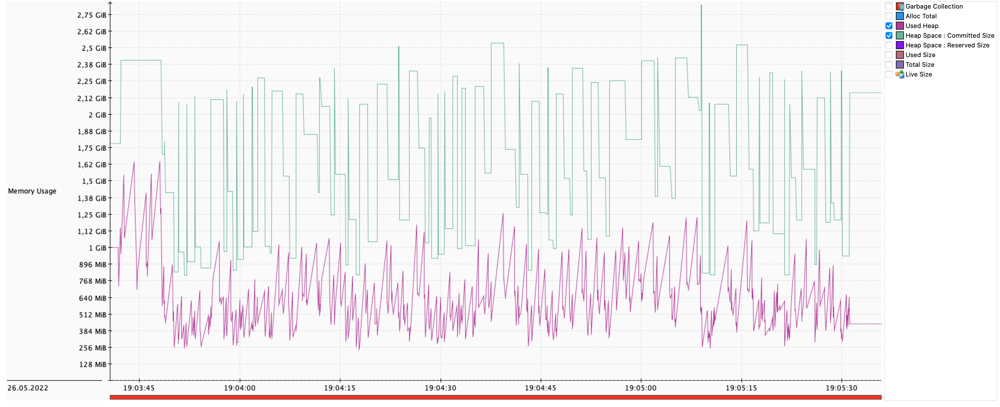
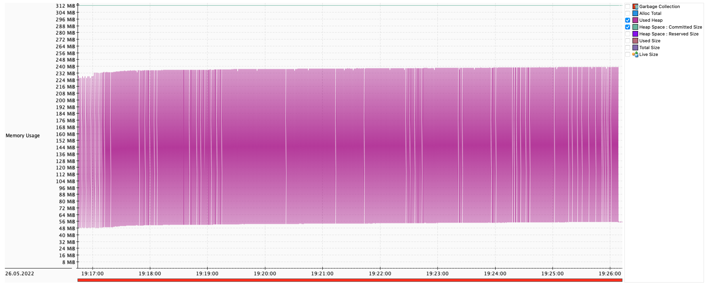

# Stream all the way down

Manchmal gibt es Situationen in denen sehr große Datensätze (~ 100.000) über eine RESTful Schnittstelle übertragen werden müssen. Dann steigt bei Java, wie bei jeder anderen Sprache auch, der Speicherverbrauch an, um das endgültige JSON-Objekt im Speicher zu erzeugen, bevor es übertragen werden kann. Hier soll eine andere Vorgehensweise vorgestellt werden, die den Speicherverbrauch stark reduzieren kann.

## Ausgangssituation

Eine RESTful Schnittstelle soll sehr viele Datensätze (~ 100.000) aus einer Datenbank abfragen und über einen HTTP-Endpunkt zur Verfügung stellen. Die Daten werden als JSON kodiert und übertragen. Eine Transformation der Daten zwischen Datenbank und HTTP Schnittstelle findet nicht statt um das Beispiel einfach und nachvollziehbar zu machen, wäre aber grundsätzlich möglich.

Um die verschiedenen Möglichkeiten zu vergleichen, überwachen den Speicherverbrauch und die Garbage-collection mithilfe des Java Flight Recorders[^2].

Folgende Controller Implementierung liefert uns den Referenzwert für den Speicherverbrauch des Services. Im Controller wird direkt ein `CrudRepository` injiziert und die `findAll()` Methode verwenden, um alle Einträge in der Datenbank abzufragen und auszugeben.

```java
@RestController
@RequestMapping("/basic/rest/authors")
public class AuthorController {

    private final BasicAuthorRepository repository;

    public AuthorController(BasicAuthorRepository repository) {
        this.repository = repository;
    }

    @GetMapping
    public Iterable<Author> getAllAuthors() {
        return repository.findAll();
    }

    @GetMapping("/{id}")
    public Optional<Author> getAuthor(@PathVariable("id") Long id) {
        return repository.findById(id);
    }
}
```
Mit dieser Implementierung bekommen wir folgende Ergebnisse:

```shell
cassowary run -u http://localhost:8080/basic/rest/authors -c 20 -n 500 -t 120 
          

Starting Load Test with 500 requests using 20 concurrent users

 100% |████████████████████████████████████████| [1m49s:0s]            1m49.329487791s


 TCP Connect.....................: Avg/mean=0.60ms 	Median=1.00ms	p(95)=1.00ms
 Server Processing...............: Avg/mean=4259.41ms 	Median=4118.50ms	p(95)=5519.00ms
 Content Transfer................: Avg/mean=56.52ms 	Median=47.00ms	p(95)=110.00ms

Summary: 
 Total Req.......................: 500
 Failed Req......................: 0
 DNS Lookup......................: 1.00ms
 Req/s...........................: 4.57
```
Es wurde `cassowary` verwendet, um 500 Requests mit 20 gleichzeitigen Nutzern abzusenden. Das Verhalten des Heapspeichers ist folgendem Diagramm zu entnehmen. Das Maximum lag bei rund 1,38 Gb, die comitted size liegt bei rund dem doppelten.



## Java Flight Recorder

Der Verbrauch der Services wurde mithilfe des Java Flight Recorders aufgezeichnet. Dazu wurde die VM mit folgenden zusätzlichen Parametern gestartet: 

```shell
-Xmx4G -XX:StartFlightRecording=disk=true,delay=15s,dumponexit=true,filename=./tmp/basic.jfr,maxsize=1024m -XX:FlightRecorderOptions=stackdepth=1024
```
Die Parameter starten die Aufzeichnung und schreiben die Daten in eine Datei `disk=true` mit dem Dateinamen `file=/tmp/basic.jfr`. Die größe der Datei wird auf `maxsize=1024m` beschränkt und der Stack wird mit einer Tiefe von 1024 `-XX:FlightRecorderOptions=stackdepth=1024` aufgezeichnet.

Die Analyse der so gewonnenen Daten erfolgt dann in Mission Control. Damit kann man neben dem Speicherverbrauch auch noch Informationen über Threads, File I/O, Socket I/O, Exceptions oder dem Garbage Collector erhalten.


## NDJSON als Alternative

Bei der Analyse der JFR Aufzeichnungen fällt auf, dass sehr viel Speicher bei der Erzeugung der JSON Objekte verbraucht wird. Eine Möglichkeit dies zu verhindern, ist, mit dem Senden zu beginnen, sobald die ersten Daten von der Datenbank zur Verfügung stehen. Mit NDJSON [^1] gibt es ein JSON basiertes zeilenorientiertes Format. Zwei einfache Regeln beschreiben erläutern wie NDJSON zu verwenden ist:

1. Das Zeilentrennzeichen ist '\n'.

    Dies bedeutet, dass '\r\n' ebenfalls unterstützt wird, da Leerzeichen am Ende beim Parsen von JSON-Werten ignoriert werden.

3. Jede Zeile ist ein gültiger JSON-Wert

    Die gebräuchlichsten Werte sind Objekte oder Arrays, aber jeder JSON-Wert ist zulässig. Weitere Informationen über JSON-Werte finden Sie unter json.org.

NDJSON eignet sich damit zum Beispiel auch für strukturierte Logausgaben. Hier soll es aber zum Übertragen von einzelnen Datensätzen verwendet werden.

In Spring Boot kann dafür auf den `StreamingResponseBody` zurückgegriffen werden, eine Methode direkt auf den `OutputStream` zu schreiben, ohne den Servlet-Thread zu blockieren. In der Hilfsmethode `getAuthorConsumer` findet die Konvertierung und Ausgabe des einzelnen Eintrags als JSON statt. Zusätzlich wird das notwendige Zeilentrennzeichen geschrieben.


```java
@RestController
@RequestMapping("/basic/stream/authors")
public class StreamingAuthorController {

    private final BasicAuthorRepository repository;
    private final ObjectMapper mapper;

    public StreamingAuthorController(BasicAuthorRepository repository, ObjectMapper mapper) {
        this.repository = repository;
        this.mapper = mapper;
    }

    @GetMapping(produces = MediaType.APPLICATION_NDJSON_VALUE)
    public ResponseEntity<StreamingResponseBody> getAllAuthors() {

        StreamingResponseBody responseBody = response -> repository
            .findAll()
            .forEach(getAuthorConsumer(response));

        return ResponseEntity
            .ok()
            .contentType(MediaType.APPLICATION_NDJSON)
            .body(responseBody);
    }

    private Consumer<Author> getAuthorConsumer(OutputStream response) {
        return entry -> {
            try {
                response.write(mapper.writeValueAsBytes(entry));
                response.write('\n'); // new line delimiter between records
                response.flush();
            } catch (IOException e) {
                throw new RuntimeException(e);
            }
        };
    }
}
```
Damit ergibt sich folgendes Ergebnis:

```shell
cassowary run -u http://localhost:8080/basic/stream/authors -c 20 -n 500 -t 120

Starting Load Test with 500 requests using 20 concurrent users

 100% |████████████████████████████████████████| [1m56s:0s]            1m56.5973705s


 TCP Connect.....................: Avg/mean=0.25ms 	Median=0.00ms	p(95)=1.00ms
 Server Processing...............: Avg/mean=4488.79ms 	Median=4392.00ms	p(95)=5377.00ms
 Content Transfer................: Avg/mean=105.47ms 	Median=91.00ms	p(95)=194.00ms

Summary: 
 Total Req.......................: 500
 Failed Req......................: 0
 DNS Lookup......................: 0.00ms
 Req/s...........................: 4.29

```


Tatsächlich ist der Speicherverbrauch etwas höher, als bei der Variante, die alle Einträge auf einmal übermittelt. Die Analyse zeigt, dass auch bei der Datenbank zunächst das gesamte Ergebnis geladen wir, obwohl ein `Iterator` verwendet wird.

## Reaktiver Datenbankzugriff

Mit Reactive Relational Database Connectivity (R2DBC) gibt es ein Projekt, dass den Datenbankzugriff reaktiv macht. Für Spring Boot gibt es ein passendes Projekt, dass ein `ReactiveCrudRepository` zur Verfügung stellt, dass geeignete reaktive Methoden zum Datenbankzugriff bereitstellt. Die notwendigen Änderungen im Controller beschränken sich darauf, das `ReactiveCrudRepository` zu verwenden und den `Flux` entsprechend weiterzuverarbeiten. Die Aufbereitung der Daten können wir aus dem vorherigen Beispiel übernehmen.  

```java
@RestController
@RequestMapping("/reactive/stream/authors")
public class StreamingAuthorController {

    private final ReactiveAuthorRepository repository;
    private final ObjectMapper mapper;

    public StreamingAuthorController(ReactiveAuthorRepository repository, ObjectMapper mapper) {
        this.repository = repository;
        this.mapper = mapper;
    }

    @GetMapping(produces = MediaType.APPLICATION_NDJSON_VALUE)
    public ResponseEntity<StreamingResponseBody> getAllAuthors() {

        StreamingResponseBody responseBody = response -> repository
            .findAll()
            .doOnNext(getAuthorConsumer(response))
            .blockLast();

        return ResponseEntity
            .ok()
            .contentType(MediaType.APPLICATION_NDJSON)
            .body(responseBody);
    }

    private Consumer<Author> getAuthorConsumer(OutputStream response) {
        return entry -> {
            try {
                response.write(mapper.writeValueAsBytes(entry));
                response.write('\n'); // new line delimiter between records
                response.flush();
            } catch (IOException e) {
                throw new RuntimeException(e);
            }
        };
    }
}
```
Damit ergibt sich folgendes Verhalten:

```shell
cassowary run -u http://localhost:8080/reactive/stream/authors -c 20 -n 500 -t 120

Starting Load Test with 500 requests using 20 concurrent users

 100% |████████████████████████████████████████| [9m30s:0s]            9m30.529923208s


 TCP Connect.....................: Avg/mean=0.32ms 	Median=0.00ms	p(95)=1.00ms
 Server Processing...............: Avg/mean=14079.72ms 	Median=13741.00ms	p(95)=19034.00ms
 Content Transfer................: Avg/mean=8420.04ms 	Median=8831.50ms	p(95)=9505.00ms

Summary: 
 Total Req.......................: 500
 Failed Req......................: 2
 DNS Lookup......................: 1.00ms
 Req/s...........................: 0.88

```



Mit dieser Lösung werden Maximal 240MB Heap benötigt, die commited size ist nur bei 321MB. Es wird also eine deutliche Reduzierung des Speicherverbrauchs erreicht. Allerdings darf die längere Antwortzeit nicht unerwähnt bleiben. Ebenfalls ist ein viel aggressiverer Garbage Collector zu beobachten. 

## Fazit

Die Kombination von reaktivem Datenbankzugriff und streamender Ausgabe an der HTTP Schnittstelle ermöglicht es umfangreiche Datensätze Speichereffizient auszuliefern. Bereits der Wechsel auf den reaktiven Datenbankzugriuff kann den Speicherverbrauch signifikant reduzieren.

## Referenzen

[^1]: NDJSON [http://ndjson.org/](http://ndjson.org/)

[^2] Java Flight Recorder [JFR](https://docs.oracle.com/en/java/java-components/jdk-mission-control/8/user-guide/using-jdk-flight-recorder.html)

[^3] Reactive Relational Database Connectivity [R2DBC](https://r2dbc.io/)

[^4] [Cassowary ](https://github.com/rogerwelin/cassowary) is a modern HTTP/S, intuitive & cross-platform load testing tool